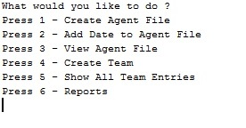
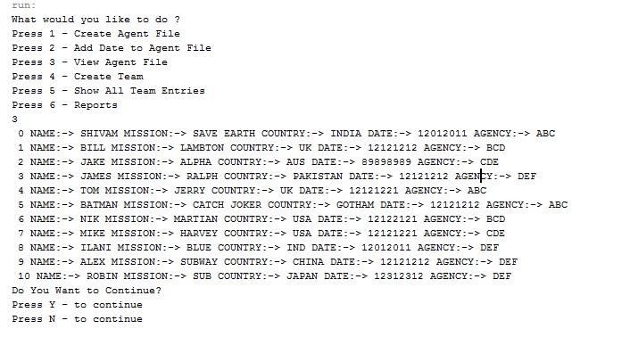
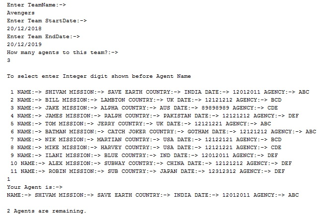
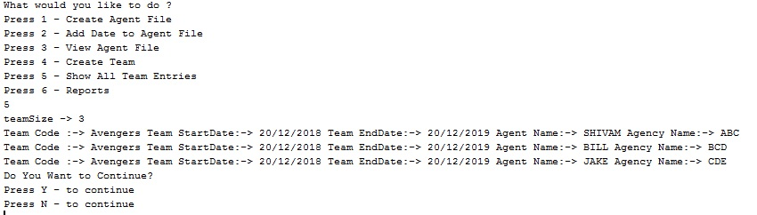
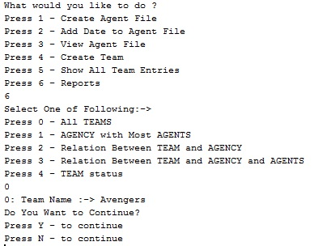
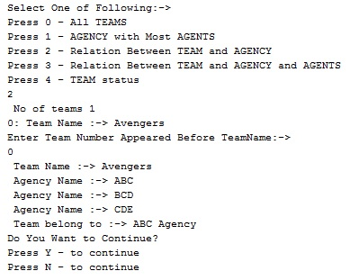
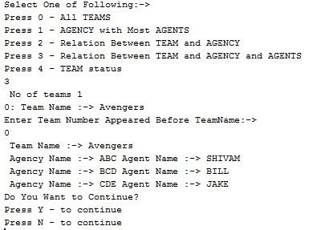

# Global "Secret Agent" Corporation App

As the director of the world's leading SuperHero Agency, your mission (should you choose to accept) is to recruit secret agents from around the world, and assign them to secret missions. All information about agents is confidential and encrypted and can only be viewed with a special decryption key.

Like all good secret agent apps, this program is based on *command line*.

# Technologies + Features

* Java 
* Encryption and Decryption Alogrithms
* Object Oriented Programming - encapsulation, inheritance, and abstraction
* Reporting features

# Screenshots

## Ask for user input
Displays a menu with all available app functions.

<table><tr><td>
    
</td></tr></table>

## View Agent File 

Decrypts an agent's information and shows it to the user.

## Create Team

Assign a secret agent to a team.

## Show Teams

Display the agents that belong to a specific team.

## Report Generation

### Report 1: Displaying the Name of all Teams

### Report 2: Display Relationship between a Team and an Agency

### Report 3: Display Relationship between Team-Agency-Agent

